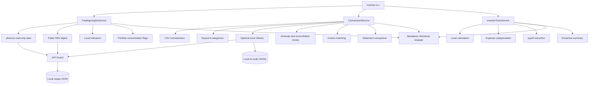

# FinPilot

> **FinPilot is a free, open-source automation toolkit that uses AI to assist with trading signal analysis, basic accounting/CA workflows, and personal investment research — with a hard API cost cap and full transparency. MIT licensed.**

[](LICENSE)
[](https://www.python.org/)

## Mandatory disclaimer

> **FinPilot does not provide financial, investment, tax, or legal advice. It is an educational automation tool. Consult a licensed professional before making financial decisions.**
>
> Trading output is informational only and is never a buy/sell recommendation. FinPilot has no brokerage write access and cannot execute trades, transfers, tax filings, or accounting postings.

## Web interface (free public demo)

FinPilot includes a Streamlit interface in `streamlit_app.py` for calculators, read-only
market research, portfolio review, CSV accounting workflows, and text-based PDF summaries.

[](https://share.streamlit.io/)

Deploy settings:

- Repository: `Fahimxbd/finpilot`
- Branch: `main`
- Main file path: `streamlit_app.py`

The public interface is deliberately **fail-closed for cost safety**:

- no paid AI provider or cloud-LLM API key;
- local/rule-based processing only;
- no field where a visitor can submit an API key;
- no brokerage, payment, transfer, filing, or ledger-write capability;
- 8 MB upload limit, 5,000-row CSV limit, 25-page PDF limit;
- 10 live market-data requests per browser session.

Streamlit Community Cloud is currently a free hosting option for community apps. Do not
enter a payment card or upgrade to a paid product for this project. Hosting providers can
change their terms in the future, so review any new billing notice before accepting it.

## What it does

### Trading insights

- Downloads read-only OHLCV history through `yfinance`.
- Computes RSI, MACD, SMA, EMA, and recent volatility locally.
- Produces plain-language descriptions of historical indicator conditions.
- Optionally creates a transparent keyword-based digest of public RSS headlines.
- Flags single-position, top-three, asset-class, and short-exposure concentration from a holdings CSV.
- Never predicts guaranteed returns, generates executable orders, or connects to brokerage write APIs.

### CA/accounting assistant

- Imports common bank and ledger CSV formats.
- Normalizes amount, debit/credit, date, description, and balance fields.
- Categorizes transactions with auditable keyword rules.
- Optionally asks a local Ollama model to classify only unresolved rows.
- Flags duplicates, high-value entries, invalid dates, low-confidence rows, and uncategorized transactions.
- Matches invoice and payment CSVs using invoice-reference and amount checks.
- Compares financial-statement line items across periods and flags material changes.
- Drafts reconciliation and tax-review notes without posting entries or filing returns.

### Investor tools

- SIP/recurring-contribution calculator.
- Compound-growth calculator.
- Goal-based monthly contribution planner with an optional inflation assumption.
- Transparent personal-expense categorization.
- Text-based research PDF extraction with a deterministic summary and optional local-Ollama plain-language rewrite.
- Clear assumptions and review flags on every result.

## Zero-cost design

FinPilot's default path requires no paid API:

- Market history: `yfinance` (read-only; check the data source's terms before redistribution or commercial use).
- News: public Google News RSS feeds.
- AI: optional local [Ollama](https://docs.ollama.com/) endpoint; disabled by default.
- PDF processing: local `pypdf` text extraction.
- Calculations and classification rules: local Python.

No package in `requirements.txt` requires a paid license. External data services can change their availability or terms, so treat adapters as replaceable and verify permitted use for your deployment.

## Architecture



## Repository layout

```text
finpilot/
├── LICENSE
├── README.md
├── SECURITY.md
├── CONTRIBUTING.md
├── .env.example
├── requirements.txt
├── pyproject.toml
├── streamlit_app.py
├── .streamlit/
│   └── config.toml
├── config/
│   └── limits.yaml
├── src/
│   ├── core/
│   │   ├── api_guard.py
│   │   ├── audit.py
│   │   ├── disclaimer.py
│   │   ├── llm_client.py
│   │   └── settings.py
│   ├── trading_insights/
│   ├── ca_assistant/
│   ├── investor_tools/
│   └── finpilot_cli.py
├── tests/
├── docs/
│   └── DISCLAIMER.md
├── sample_data/
│   ├── bank_transactions.csv
│   ├── holdings.csv
│   ├── invoices.csv
│   ├── payments.csv
│   └── financial_statement.csv
└── .github/workflows/ci.yml
```

## Setup

### 1. Clone and create a virtual environment

```bash
git clone https://github.com/Fahimxbd/finpilot.git
cd finpilot
python -m venv .venv
```

Activate it:

```bash
# Linux/macOS
source .venv/bin/activate

# Windows PowerShell
.venv\Scripts\Activate.ps1
```

### 2. Install

```bash
python -m pip install --upgrade pip
pip install -e ".[dev]"
cp .env.example .env  # Windows: copy .env.example .env
```

FinPilot reads environment variables from your shell. It deliberately does not add a secret-loading framework; use your shell, deployment platform, or a reviewed `.env` loader.

### 3. Optional local AI

Install Ollama separately, download a local model, and enable it:

```bash
ollama pull gemma3:4b
export FINPILOT_ENABLE_LLM=true
export OLLAMA_MODEL=gemma3:4b
```

The deterministic keyword categorizer works without Ollama.

## Usage

### Trading indicator summary

```bash
finpilot trading AAPL --period 6mo
finpilot trading MSFT --period 1y --news
```

### Portfolio concentration review

```bash
finpilot portfolio sample_data/holdings.csv
```

### Categorize a ledger/bank CSV

```bash
finpilot categorize sample_data/bank_transactions.csv --output categorized.csv
```

Use the local LLM only for unresolved descriptions:

```bash
FINPILOT_ENABLE_LLM=true finpilot categorize transactions.csv --use-local-llm
```

### Personal expense categorization

```bash
finpilot expenses sample_data/bank_transactions.csv --output expenses.csv
```

### Invoice reconciliation

```bash
finpilot reconcile-invoices sample_data/invoices.csv sample_data/payments.csv
```

### Financial-statement comparison

```bash
finpilot statement-summary sample_data/financial_statement.csv --change-flag-percent 25
```

### SIP estimate

```bash
finpilot sip --monthly 500 --annual-rate 8 --years 10 --initial 1000
```

### Goal estimate

```bash
finpilot goal --target 100000 --years 8 --annual-rate 7 --current 10000 --inflation 3
```

### Research PDF summary

```bash
finpilot pdf-summary research.pdf --max-pages 30 --sentences 8
FINPILOT_ENABLE_LLM=true finpilot pdf-summary research.pdf --use-local-llm
```

Scanned/image-only PDFs are rejected instead of silently producing unreliable OCR output.

## How the hard API cap works

`config/limits.yaml` is the source of truth:

```yaml
max_monthly_api_calls: 500
max_tokens_per_run: 8000
near_limit_ratio: 0.80
min_seconds_between_calls: 1.0
queue_on_throttle: true
```

The guard:

1. Reserves budget before each external or local-AI call.
2. Blocks calls that would cross a global monthly limit.
3. Blocks service-specific monthly limits.
4. Blocks an AI request that would cross the per-run token cap.
5. Warns near the configured threshold.
6. Queues by sleeping when calls occur too quickly, or raises when queueing is disabled.
7. Stores usage in `.finpilot/usage.json` using an atomic write and file lock.
8. Rolls back a reservation when the underlying call fails.

Environment overrides:

```bash
export MAX_MONTHLY_API_CALLS=100
export MAX_TOKENS_PER_RUN=4000
export FINPILOT_USAGE_FILE=/secure/path/usage.json
```

Inspect current usage:

```bash
finpilot usage
```

## AI audit log

Every local AI call writes metadata to `.finpilot/ai_audit.jsonl`, including:

- timestamp, provider, and model;
- prompt/response SHA-256 hashes;
- character counts and token estimate;
- success/error status.

Full financial document content is **not** logged by default. Explicitly enable it only in a controlled environment:

```bash
export FINPILOT_LOG_FULL_AI_CONTENT=true
```

## Tests and quality checks

```bash
pytest --cov=src --cov-report=term-missing
ruff format --check .
ruff check .
```

CI runs formatting, lint, and tests on Python 3.11, 3.12, and 3.13.

## Security and privacy

- Do not upload sensitive statements to an untrusted model or host.
- Prefer local Ollama for transaction descriptions.
- Review CSV/PDF contents before processing.
- Audit output before relying on it.
- Never place secrets in Git or commit `.env`/`.finpilot`.

See [SECURITY.md](SECURITY.md) and [docs/DISCLAIMER.md](docs/DISCLAIMER.md).

## Contributing

Contributions are welcome. Keep the following boundaries intact:

- no trade, transfer, filing, or posting execution;
- no paid-only dependency as the default path;
- all financial output must pass through the disclaimer wrapper;
- every new external/AI call must pass through `APIGuard`;
- tests must not require internet access or secrets.

Read [CONTRIBUTING.md](CONTRIBUTING.md) before opening a pull request.

## License

MIT. See [LICENSE](LICENSE).
